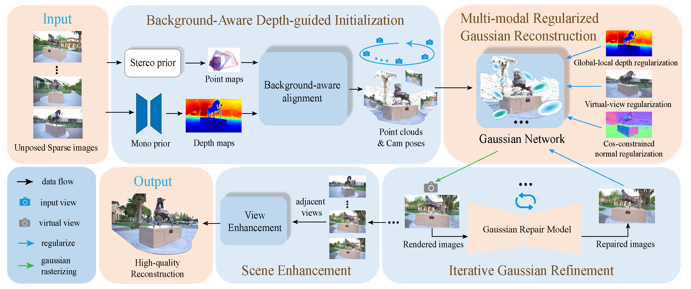

# LM-Gaussian: Boost Sparse-view 3D Gaussian Splatting with Large Model Priors

[**Paper**](https://arxiv.org/abs/2409.03456) | [**Project Page**](https://hanyangyu1021.github.io/lm-gaussian.github.io/) | [**Video**](https://www.youtube.com/watch?v=ic4luAY_Hvk)

Official implementation of LM-Gaussian: Boost Sparse-view 3D Gaussian Splatting with Large Model Priors

[Hanyang Yu](https://hanyangyu1021.github.io/), [Xiaoxiao Long](https://www.xxlong.site/) and [Ping Tan](https://ece.hkust.edu.hk/pingtan).

Abstract: *We aim to address sparse-view reconstruction of a 3D scene by leveraging priors from large-scale vision models. While recent advancements such as 3D Gaussian Splatting (3DGS) have demonstrated remarkable success in 3D reconstruction, these methods typically necessitate hundreds of input images that densely capture the underlying scene, making them time-consuming and impractical for real-world applications. However, sparse-view reconstruction is inherently ill-posed and under-constrained, often resulting in inferior and incomplete outcomes. This is due to issues such as failed initialization, overfitting to input images, and a lack of detail. To mitigate these challenges, we introduce LM-Gaussian, a method capable of generating high-quality reconstructions from a limited number of images. Specifically, we propose a robust initialization module that leverages stereo priors to aid in the recovery of camera poses and the reliable initialization of point clouds. Additionally, a diffusion-based refinement is iteratively applied to incorporate image diffusion priors into the Gaussian optimization process to preserve intricate scene details. Finally, we utilize video diffusion priors to further enhance the rendered images for realistic visual effects. Overall, our approach significantly reduces the data acquisition requirements compared to previous 3DGS methods. We validate the effectiveness of our framework through experiments on various public datasets, demonstrating its potential for high- quality 360-degree scene reconstruction.*

## Method

Our method takes unposed sparse images as inputs. For example, we select 8 images from the Horse Scene to cover a 360-degree view. Initially, we utilize a Background-Aware Depth-guided Initialization Module to generate dense point clouds and camera poses (see Section IV-B). These variables act as the initialization for the Gaussian kernels. Subsequently, in the Multi-modal Regularized Gaussian Reconstruction Module (see Section IV-C), we collectively optimize the Gaussian network through depth, normal, and virtual-view regularizations. After this stage, we train a Gaussian Repair model capable of enhancing Gaussian-rendered new view images. These improved images serve as guides for the training network, iteratively restoring Gaussian details (see Section IV-D). Finally, we employ a scene enhancement module to further enhance the rendered images for realistic visual effects (see Section IV-E).

<p align="center">
    
</p>

<h2>TODO List</h2>     <ul>         <li>             <input type="checkbox" id="task1">             <label for="task1">Support 2D-GS</label>         </li>         <li>             <input type="checkbox" id="task2">             <label for="task2">Support Scaffold-gs</label>        </li>      <li>             <input type="checkbox" id="task3">             <label for="task3">Add Increamental Test pose alignment module</label>         </li>   <li>         <input type="checkbox" id="task3">             <label for="task4">Support controlnet-tile-sdxl-1.0</label>         </li>  </ul>

## 🚀 Setup

### CUDA

LM-Gaussian is tested with CUDA 11.8.

### Cloning the Repository

<ol>
    <li>
        <strong>Clone LM-Gaussian and download relevant models:</strong>
        <pre><code>git clone https://github.com/hanyangyu1021/LMGaussian.git --recursive</code></pre>
    </li>
    <li>
        <strong>Create the environment:</strong>
       LM-Gaussian is tested on Python 3.10.12. Requirements are listed in requirements.txt. You can install them with<br>
        <pre><code>conda env create --file environment.yml
    </li>
</ol>

### Get Monocular Depth/Normal Maps

<p>Put unposed sparse images in the <code>'./data/{dataset_name}/train/images/'</code> folder. Checkpoints can be found at:
<ul>
    <li>
        <a href="https://huggingface.co/prs-eth/marigold-depth-lcm-v1-0">Marigold Depth LCM v1.0</a>
    </li>
    <li>
        <a href="https://huggingface.co/prs-eth/marigold-normals-lcm-v0-1">Marigold Normals LCM v0.1</a>
    </li>
</ul>
Download the relevant checkpoints to 
<code>./Marigold/checkpoint/marigold-depth-lcm-v1-0/</code> and 
<code>./Marigold/checkpoint/marigold-normals-lcm-v0-1/</code>

</p>
<pre><code>python Marigold/getmonodepthnormal.py -s data/horse16</code></pre>

### Dense Initialization

<p>

Download the dust3r checkpoint <code>"DUSt3R_ViTLarge_BaseDecoder_512_dpt.pth"</code> and place it into
<code>'./dust3r/checkpoints/DUSt3R_ViTLarge_BaseDecoder_512_dpt.pth'</code>.

</p>
<p>
    <a href="https://download.europe.naverlabs.com/ComputerVision/DUSt3R/DUSt3R_ViTLarge_BaseDecoder_512_dpt.pth">
        DUSt3R Checkpoint
    </a>
</p>
Here we provide a simple example of horse scene in TNT. You can find the data in ./data
<pre><code>python dust3r/coarse_initialization.py -s data/horse16</code></pre>

### Multi-modal Regularized Reconstruction

<pre><code>python stage1_360.py -s data/horse16 --save outputs/horse16</code></pre>

<h3>Train Repair model</h3>

<p>To set up the model, download the following checkpoints to the <code>./models</code> folder:</p>  
    <ul>
        <li>
            <a href="https://huggingface.co/runwayml/stable-diffusion-v1-5/tree/main">v1-5-pruned.ckpt</a>
        </li>
        <li>
            <a href="https://huggingface.co/lllyasviel/ControlNet-v1-1/blob/main/control_v11f1e_sd15_tile.pth">control_v11f1e_sd15_tile.pth</a>
        </li>
        <li>
            <a href="https://huggingface.co/lllyasviel/ControlNet-v1-1/blob/main/control_v11f1e_sd15_tile.yaml">control_v11f1e_sd15_tile.yaml</a>
        </li>
    </ul>

Download clip-vit-large-patch14 model to ./[openai](https://huggingface.co/openai/clip-vit-large-patch14)

<pre><code>python train_repairmodel.py   --exp_name outputs/controlnet_finetune/horse16 --prompt "any prompt describe the scene" --resolution 1 --gs_dir outputs/horse16 --data_dir data/horse16   --bg_white </code></pre>

<h2>Iterative refinement</h2>
<pre><code>python stage2_360.py  -s data/horse16  --exp_name outputs/controlnet_finetune/horse16 --prompt "any prompt describe the scene" --bg_white  --start_checkpoint "outputs/horse16/chkpnt12000.pth"</code></pre>
<pre><code>python stage2_forward.py  -s data/barn3 --exp_name outputs/controlnet_finetune/barn3 --prompt "Houses, playground, outdoor" --bg_white  --start_checkpoint "outputs/barn3/chkpnt6000.pth"</code></pre>

### Render video & Scene enhancement

<pre><code>python render_interpolate.py -s data/horse16 --start_checkpoint outputs/horse16/chkpnt30000.pth</code></pre>

Checkpoints can be found at:

<ul>
    <li>
        <a href="https://huggingface.co/cerspense/zeroscope_v2_XL">Zeroscope_v2_XL</a>
    </li>
</ul>
Download the checkpoints to 
<code>./models/zeroscope_v2_XL/</code>

</p>
<pre><code>python scene_enhance.py --model_path ./models/zeroscope_v2_XL --input_path outputs/horse16/30000_render_video.mp4</code></pre>

## 🤗Acknowledgement

This work is built on many amazing research works and open-source projects, thanks a lot to all the authors for sharing!

- [DUSt3R](https://github.com/naver/dust3r)
- [GaussianObject](https://github.com/GaussianObject/GaussianObject)
- [RaDe-GS](https://github.com/BaowenZ/RaDe-GS)

## 🌏Citation

If you find our work useful in your research, please consider giving a star :star: and citing the following paper :pencil:.

```bibTeX
@misc{yu2024lmgaussianboostsparseview3d,
      title={LM-Gaussian: Boost Sparse-view 3D Gaussian Splatting with Large Model Priors}, 
      author={Hanyang Yu and Xiaoxiao Long and Ping Tan},
      year={2024},
      eprint={2409.03456},
      archivePrefix={arXiv},
      primaryClass={cs.CV},
      url={https://arxiv.org/abs/2409.03456}, 
}
```
